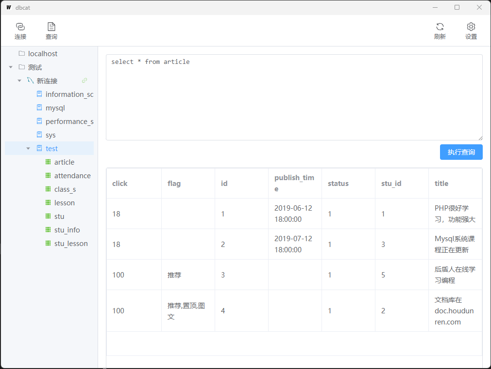

  <h1>DBCat 数据库管理工具</h1>
  
  

    <a href="README.md">English</a> | 
    <a href="README_ZH.md">中文</a>
  

  
  

# DBCat

DBCat 是一个轻量级的跨平台数据库管理工具，使用 Go + Vue3 开发。

### ✨ 主要功能

- 🚀 多数据库支持
  - MySQL
  - PostgreSQL
  - SQLite
- 📝 数据库操作
  - 数据库创建与管理
  - 表结构查看
  - SQL 查询执行
  - 数据浏览与编辑
- 🎨 用户友好界面
  - 树形结构展示
  - 自定义分组管理
  - 支持拖拽排序
  - 查询结果表格展示
- 🛠 开发者友好
  - 支持多语句执行
  - SQL 注释智能处理
  - 自定义连接配置
  - 连接池管理

### 🔧 技术栈

- 后端：Go + sqlx
- 前端：Vue3 + TypeScript + Element Plus
- 框架：Wails

### 📦 安装 